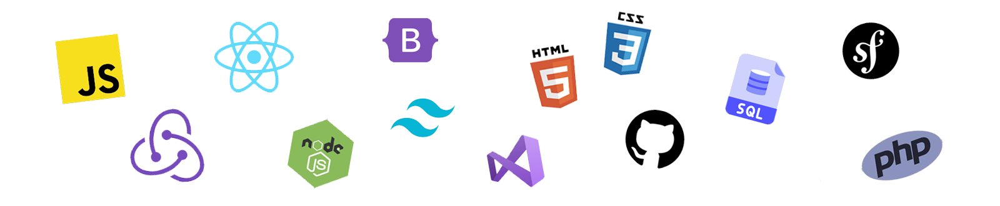

<!--
**Andhromede/Andhromede** is a ✨ _special_ ✨ repository because its `README.md` (this file) appears on your GitHub profile.

Here are some ideas to get you started:

- 🔭 I’m currently working on ...
- 🌱 I’m currently learning ...
- 👯 I’m looking to collaborate on ...
- 🤔 I’m looking for help with ...
- 💬 Ask me about ...
- 📫 How to reach me: ...
- 😄 Pronouns: ...
- ⚡ Fun fact: ...
-->

<h1 align="center">Hi there, my name is Nathalie 👋</h1>

Software Engineer | Back-End developper (C# / .Net) | front-end developper (React)

 

 

<!-- ABOUT ME -->
## About Me 🕵️‍♀️
😄💬 Hello ! I'm Nath, a passionate software engineer with a strong interest in new technologies. I enjoy working on challenging problems and building innovative solutions. My expertise lies in back-end development, but I'm always eager to learn and develop my knowledge.

 

<!-- CONTACT -->
## Contact Me ✍🏻

<!-- * 🔖 Discover my [Portfolio (...incoming...)]( )  -->
* 💼 Currently in training at [Simplon](https://simplon.co/)
* 🔭 I’m currently learning __C# and .Net__
* 👩‍💻 My linkedIn: [profil](https://www.linkedin.com/in/nathalie-gibilaro/)
* 📫 Contact me: [contact@gibilaro-nathalie.fr]

 

<!-- SKILLS -->
## My skills 💻

  

   

<!--  -->

<!-- IN PROGRESS -->
## Skills in progress ... ✍🏻

  <!--  -->
  

   

  

&nbsp;

<!-- 
 
    

 -->

<!-- INTERESTS -->
## Interests
- 📱 New technologies
- 🎨 Infographics
- 🧙‍♀️ Role play games
- 🎬 Horror movies
- 🎸 Hard rock
- 🏊‍♀️ Swimming

